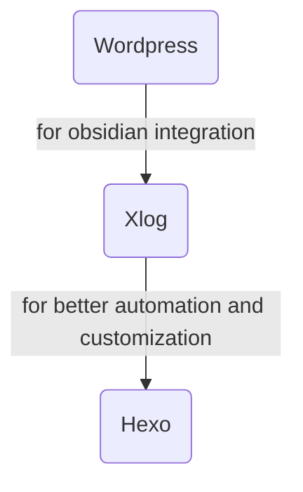

Setting up hexo is quiet a pain in the first place. But thanksfully it has been done by now.

I switch to here because it has first class markdown support, which would be easier to automate posting and have more seamless integration with my writing workflow in Obsidian compare to wordpress. The more I dive into the world of blogging, the more I feel that heavy tools like wordpress is not intended for tech-savvy people. It is a pain trying to automate your workflow with all those layers intended to cater people without technical backgroud. It is not bad, just that you can't get the best from both of the world simultaneously.

Compare to xlog, I also find it more customizable and I can gain more control. Its great integration with mermaid makes it perfect blogging choice for me.

Only after a few hours of tweaking, I'm already pretty comfortable with the workflow here. It is pretty effortless to post my blogs this way.

Hope this will be the end of my hopping between different blogging systems.

