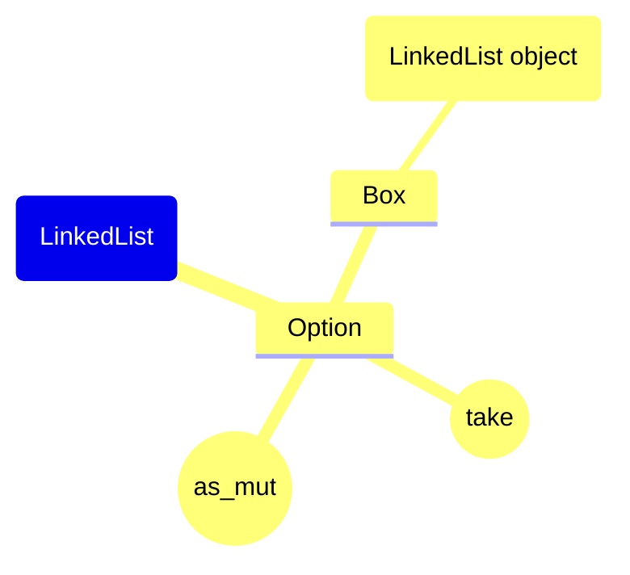

It is quite a hassle to learn the linked list in Rust, pure madness when you see expression like `Option<Box<LinkedList>>` for the first time. I write down about things that were unfamiliar to me here, which is a lot!

## Concepts

One way to use a defined linked list in rust is like `Option<Box<LinkedList>>`, where you use two wrapper to ensure 1) optional presence of the object, like `nullptr` in cpp and 2) fixed size pointer to the next element.

The following concepts occurs in the manipulation of the LinkedList in Rust. Generally, you might want to use `as_mut()` and `take()` method of `Option` type to do the Linked List manipulation.



Signature for `take`:

```rust
pub fn take(&mut self) -> Option(T)
```

`take()` fill the original `Option` object or `Result` with default value (`None` or `Err` respectively). This is used to take ownership of a mutable `Option()` enum **from a mutable reference** of it.

To create a mutable reference on such `Option`, you use the `as_mut()` trait implemented on `Option`, to convert from `&mut Option<T>` to `Option<&mut T>` . The signature is as following:

```rust
fn as_mut(&mut self) -> &mut T;
```

With all these magics, we can finally do some operation like `node1.next = node2; auto tmp = node2.next;` in cpp with:

```rust
// to change the pointer to another
node2.as_mut()?.next = node1;
// move the next from current node to an independent variable
let node3 = node2.as_mut()?.next.take();
// moving object itself is easy
node1 = node2;
node2 = node2;
```

## Why bother using `Box` ?

In Rust, the `Box` type is a smart pointer for data allocated on heap. When a `Box` goes out of scope, its destructor is called and the heap memory is deallocated.

The reason we use `Box` for the `ListNode` in a `LinkedList` is because of Rust's ownership and size requirements. In Rust, all variables and data must have a known size at compile time. However, a `LinkedList` is a recursive data structure where a node can contain another node. If we tried to define it without a `Box`, it would have an infinite size because each node contains another node, which contains another node, and so on.

By using a `Box`, we're storing the `ListNode` on the heap instead of directly in the parent node. This means that the parent node only needs to store the `Box`, which has a known size (it's a pointer to the heap memory).

Here's what the `ListNode` might look like:

```rust
pub struct ListNode {
    pub val: i32,
    pub next: Option<Box<ListNode>>,
}
```

In this definition, each `ListNode` contains an `Option` that may contain a `Box` pointing to the next `ListNode`. The `Option` is used to indicate that the `next` field might be `None` (there might not be a next node), and the `Box` is used to store the next `ListNode` on the heap.

So `Option` alone is not enough because it doesn't solve the size requirement issue. We need `Box` to allocate the `ListNode` on the heap and have a known size for the `next` field.

## How then to create a cycle LinkedList?

`Box` is a smart pointer, or more specifically, a unique pointer in cpp. This means that the linked list created in `Box` is guaranteed to not have a circle, because `Box` takes exclusive ownership of the data it points to, preventing multiple mutable references to the same data, thereby avoiding potential data races.

Creating a cycle in a `LinkedList` in Rust is indeed challenging due to Rust's ownership model and the way it prevents data races. However, there are ways to create cycles or more complex structures in Rust, but they involve using `Rc` (Reference Counting) and `RefCell` types. `Rc` allows multiple owners for the same data, and `RefCell` allows interior mutability, which means we can mutate the data even when there are immutable references to it.

Here is an example of how to create a cycle:

```rust
use std::rc::Rc;
use std::cell::RefCell;

struct Node {
    value: i32,
    next: Option<Rc<RefCell<Node>>>,
}

fn main() {
    let node1 = Rc::new(RefCell::new(Node { value: 1, next: None }));
    let node2 = Rc::new(RefCell::new(Node { value: 2, next: Some(node1.clone()) }));

    // Create a cycle
    node1.borrow_mut().next = Some(node2.clone());
}
```

In this example, `node1` points to `node2`, and `node2` points back to `node1`, creating a cycle. The `Rc` type allows both nodes to own the other, and the `RefCell` type allows us to mutate `node1` to point to `node2` even though `node1` is initially immutable.

However, Cycles like this can lead to memory leaks. In this example, `node1` and `node2` will never be deallocated because they always have a reference count greater than zero due to the cycle. Rust's `Rc` type doesn't have a way to detect or deal with cycles.

So, while it's possible to create a cycle in a `LinkedList` in Rust, it should be done very carefully, if at all, to avoid memory leaks.

## References

### Practical usage of linked list with cycle? (Answer from GPT4)

Yes, there are practical uses for cyclic or circular linked lists in real-world applications. Here are a few examples:

1. **Round-Robin Scheduling**: This is a type of scheduling algorithm used in operating systems and other systems that deal with time-sharing. The list of tasks is kept in a circular linked list, and the scheduler rotates through the tasks, giving each one a small slice of time to execute. When a task has had its turn, the scheduler moves to the next task in the circular list.
2. **Multiplayer Board Games**: In many multiplayer games, the turn-based system can be implemented with a circular linked list. Each node represents a player, and the current node represents the player whose turn it is. After each turn, the game advances to the next player in the circular list.
3. **Image Carousel or Slideshow**: In a web or mobile application, an image carousel or slideshow might use a circular linked list to cycle through images. When the user reaches the last image, the next image is the first one, creating a seamless loop.
4. **CPU Cache Organization**: In computer architecture, some caching systems use circular buffers (which can be implemented with circular linked lists) to manage memory.
5. **Navigation Systems**: Some navigation systems use circular linked lists to cycle through options or menus.

While these are practical uses, it's worth noting that other data structures (like arrays or array lists) can often be used to achieve the same goals, sometimes with better performance characteristics. The choice of data structure depends on the specific requirements of the situation.
