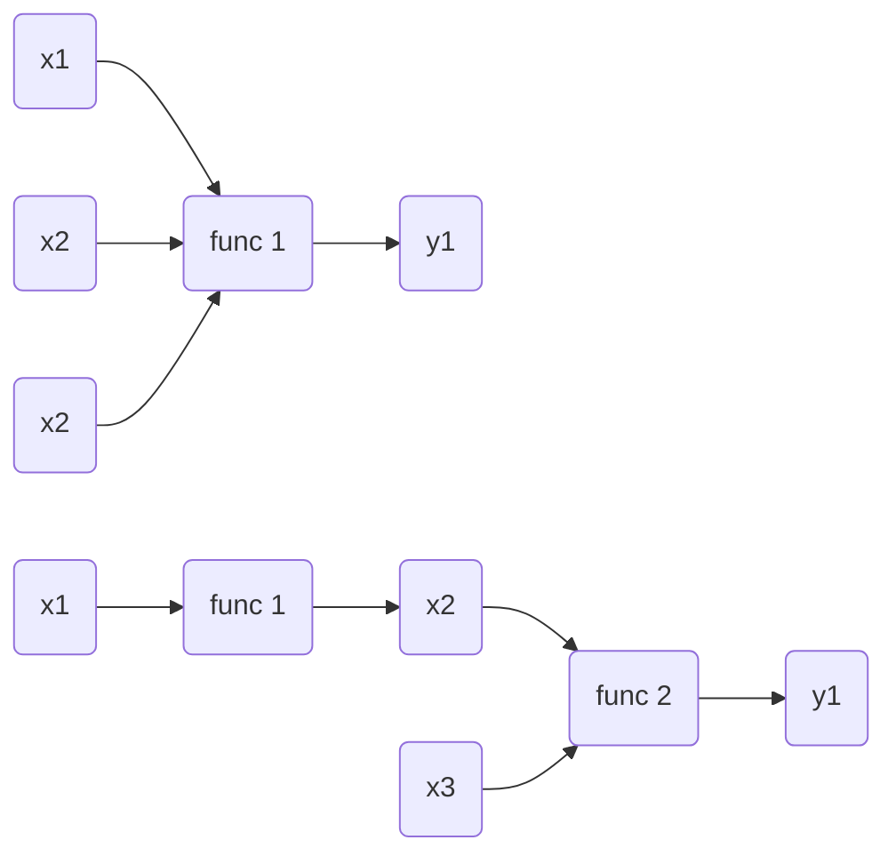
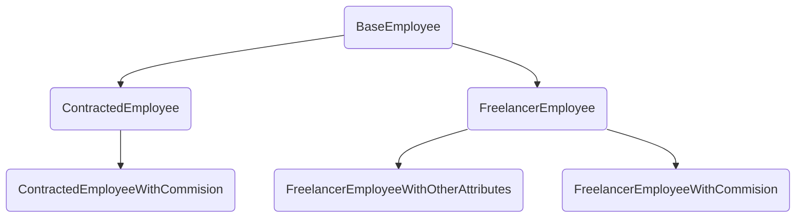
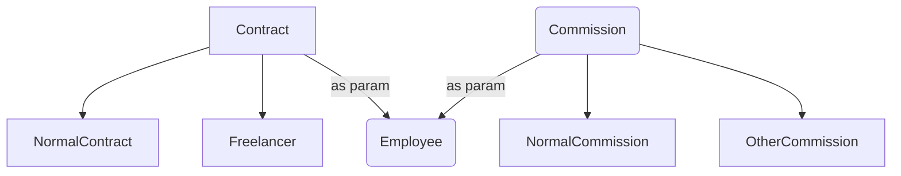

## Why “Prefer Composition over Inheritance”?

I shared recently how frustrated I am with the complexity of my project's codebase. Basically it is too complicated and intertwined. Despite my discomfort, I had to find a solution which led me to design patterns.

One principle I heard many times is "Prefer Composition over Inheritance." Initially, I had only a vague understanding of the difference between the two, let alone how to implement this concept in my project. However, [this video from ArjanCodes](https://www.youtube.com/watch?v=0mcP8ZpUR38) helped me understand the rationale, which I'm now going to explain.

### Coupling creates complexity

When designing a project, particularly in Object-Oriented Programming, complexity can escalate rapidly due to interactions and dependencies between different objects. This complexity stems from **coupling**.

Complex coupling can lead to several issues. It can make modifying and adding new features a daunting task, as you must consider the intricate interplay between different objects. Changes cloud have unforeseen consequence throughout the codebase. Moreover, unit testing becomes more challenging with highly coupled code as you need to test all scenarios to achieve sufficient coverage.

The diagram below illustrates different levels of system coupling. Highly coupled systems require testing of all possible input combinations. However, by decoupling computations into steps, each function can be verified by examining a single input and its corresponding output, which is much easily for testing.

 Comparison between different levels of coupling 

### Complex Inheritance structure introduce coupling

Drawing from Arjan's example, in a purely inheritance-based approach, an `Employee` class might encapsulate all actions related to an employee, such as id, age, gender, and payment method. For each employee type, you create a subclass derived from the base classes. This approach solves problems through inheritance.

However, if you assign all responsibilities to a monolithic `Employee` class, the growing project and its evolving needs will eventually result in a sprawling hierarchy tree. Each piece is dependent on its parent, creating indirect coupling between child classes sharing the same parent. Modifying any base class could result in chaos. If a new variant has even a minor incompatible requirement from your existing implementation, you might have to inherit from a very base class and reimplement all features. In short, **Inheritance creates coupling**, and overusing it complicates rather than simplifies your work.

 A complex Inheritance tree

### Prioritize Interface

The issue isn't saying that we should not creating complex systems, but rather ensuring a logical separation of components within these systems. If we examine the previous example, the `Employee` class is problematic due to multiple responsibilities assigned to it. It subdivides different employee types and manages various payments and commissions, tasks that could be **handled by separate instances**.

To address this, we could create a `Contract` class for different contract types, and a `Commission` class for various commissions. These instances could then be passed to an `Employee` class. As long as these maintain a unified interface, our task becomes much simpler.

 This looks much better, isn’t it?

### Conclusion

The design patterns is pretty new to me, but I can kind of see what they are aiming to — to lower the complexity of the system and make it modular if possible.

The idea of “Composition over Inheritance” is pretty similar to the dependency injection in the abstract level. They are all different terms expressing the same goal to separate and preserve the local simplicity, and thereby enhancing code maintainability and flexibility.

## References

[Why COMPOSITION is Better Than INHERITANCE - Detailed Python Example](https://www.youtube.com/watch?v=0mcP8ZpUR38)

[Dependency INVERSION vs Dependency INJECTION in Python](https://www.youtube.com/watch?v=2ejbLVkCndI)

